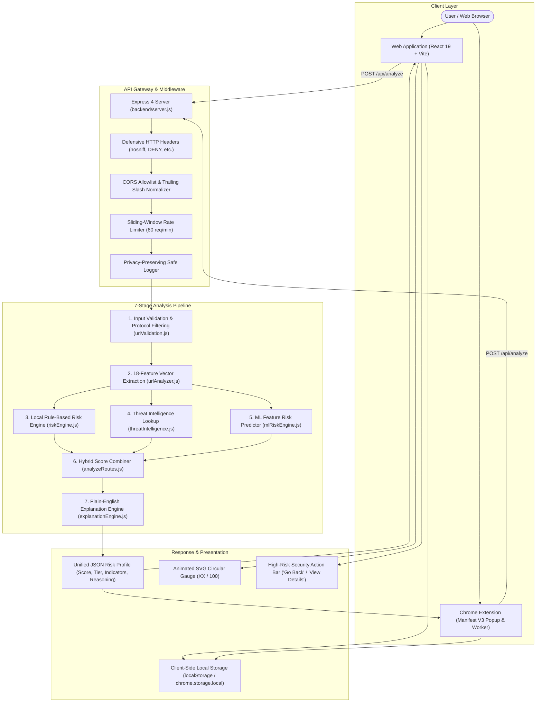

# WebGuard AI — Technical System Architecture & Specification

> *"Don't just detect the threat. Understand it."*

---

## 1. System Overview

WebGuard AI is an explainable, multi-signal phishing detection and URL risk analysis system designed to operate both as an interactive web dashboard and a real-time browser extension.

### Core Architecture Diagram

---

## 2. Component Architecture

### A. Frontend Architecture (`frontend/`)
- **Framework**: React 19 Single-Page Application bootstrapped with Vite 8.2.
- **Design System**: Vanilla CSS tokens in [`frontend/src/App.css`](file:///Users/achantiabhishek/fack%20web%20site%20detector%20AN/frontend/src/App.css) supporting glassmorphic cards, custom typography, responsive breakpoints (`768px`, `480px`), and dark cybersecurity aesthetics.
- **Key Components**:
  - `Header.jsx`: Unified navigation (`Analyze`, `Dashboard`, `History`, `About`, `Awareness`, `Browser Protection`) and live backend heartbeat monitor.
  - `UrlScanner.jsx`: Main search stage with auto-focus, lock icon, clear button, loader state with `Loader2`, and preset example URLs.
  - `ScanningProgress.jsx`: Multi-stage radar animation visually tracking the 7 pipeline phases during analysis.
  - `AnalysisResult.jsx`: Result showcase featuring the **animated SVG circular Threat Score gauge**, dedicated High-Risk warning bar with "Go Back" / "View Details" actions, indicator cards with severity badges, threat intel breakdown, and collapsible technical extraction details.
  - `Dashboard.jsx`: Analytics overview with metric cards (Total Scans, Low Risk, Suspicious, High Risk), average score, threat distribution, and timeline.
  - `ScanHistory.jsx`: Searchable local scan history with risk filtering chips and JSON export.
  - `DemoScenarios.jsx`: Preset harmless test scenarios (Safe, Suspicious, High Risk) for instant hackathon demonstration.

### B. Backend Architecture (`backend/`)
- **Server**: Node.js (ESM) with Express 4 in [`backend/server.js`](file:///Users/achantiabhishek/fack%20web%20site%20detector%20AN/backend/server.js).
- **Security Middleware**:
  - `nosniff`, `X-Frame-Options: DENY`, `X-XSS-Protection`, `Referrer-Policy: strict-origin-when-cross-origin`, removal of `X-Powered-By`.
  - In-memory sliding-window rate limiting (`backend/middleware/rateLimiter.js`) enforcing 60 requests per minute per IP address.
  - Strict 10KB payload limits preventing memory exhaustion attacks.
  - Safe logger (`backend/middleware/safeLogger.js`) that sanitizes incoming query strings before logging.
- **Endpoints**:
  - `GET /api/health`: Health & readiness check returning service status, active analysis mode, and TI readiness without exposing credentials.
  - `POST /api/analyze`: Primary analysis route executing the 7-stage pipeline.

### C. Chrome Extension Architecture (`extension/`)
- **Manifest V3 Specification**:
  - `background.js`: Service worker handling extension lifecycle and optional automated tab inspection.
  - `popup.html` & `popup.js`: Responsive 360px popup with dark glassmorphism theme matching the web application.
  - `config.js`: Central configuration switcher (`ACTIVE_ENV = 'development' | 'production'`) holding endpoints, timeouts, and storage keys.
- **Permissions**:
  - `activeTab`: Inspects the active tab's URL string on user demand.
  - `storage`: Persists scan history and settings in `chrome.storage.local`.
  - `notifications`: Alerts the user when suspicious or high-risk sites are encountered.

---

## 3. Data Flow & Analysis Pipeline

### Stage 1: Input Validation & Sanitization ([`urlValidation.js`](file:///Users/achantiabhishek/fack%20web%20site%20detector%20AN/backend/utils/urlValidation.js))
- Validates protocol against explicit allowlist (`http:`, `https:`).
- Rejects pseudo-protocols (`javascript:`, `data:`, `file:`, `chrome:`, `about:`, `vbscript:`).
- Rejects control characters, null bytes (`\0`), and URLs exceeding 2,048 characters.

### Stage 2: Feature Extraction ([`urlAnalyzer.js`](file:///Users/achantiabhishek/fack%20web%20site%20detector%20AN/backend/services/urlAnalyzer.js))
Extracts 18 structural and lexical indicators:
1. `isHttps`: Protocol encryption status.
2. `usesIpAddress`: Hostname is a raw IPv4/IPv6 address.
3. `urlLength`: Total character length of URL.
4. `subdomainCount`: Depth of subdomain labels before the apex domain.
5. `hasAtSymbol`: Presence of `@` sign in authority component.
6. `hasPunycode`: Hostname begins with or contains `xn--`.
7. `isShortenedUrl`: Apex domain matches known shortening services.
8. `suspiciousPort`: Non-standard port specified (e.g., 8080, 8443, 8000).
9. `suspiciousKeywords`: Frequency of high-risk terms (`login`, `verify`, `account`, `banking`, `secure`).
10. `brandImpersonation`: Target brand name located in subdomain/path while apex domain belongs to another entity.
11. `hyphenCount`: Excessive hyphens in domain name.
12. `hexEncodedChars`: Presence of obfuscated `%20` or `%00` encoding.
13. `tldRisk`: High-risk disposable top-level domains (`.xyz`, `.top`, `.tk`, `.ml`).
14. `entropyScore`: Shannon entropy measuring character randomness.
15. `digitCountHost`: Number of numeric digits in hostname.
16. `consecutiveSubdomains`: Excessive chaining of subdomains.
17. `pathDepth`: Depth of URL path segments.
18. `hasDoubleSlashRedirect`: Obfuscated `//` within path segments.

### Stage 3: Local Rule-Based Risk Engine ([`riskEngine.js`](file:///Users/achantiabhishek/fack%20web%20site%20detector%20AN/backend/services/riskEngine.js))
- Evaluates individual indicators and assigns weighted risk points.
- Each fired indicator produces: `{ id, name, severity, points, description }`.
- Generates a local risk score between 0 and 100.

### Stage 4: Threat Intelligence Lookup ([`threatIntelligence.js`](file:///Users/achantiabhishek/fack%20web%20site%20detector%20AN/backend/services/threatIntelligence.js))
- If configured with `VIRUSTOTAL_API_KEY` or `GOOGLE_SAFE_BROWSING_API_KEY`, queries the provider API.
- If unconfigured or rate-limited, safely returns `available: false` and enables **Local Analysis Mode**.
- Yields reputation signal: `knownMalicious`, `suspicious`, `clean`, or `unavailable`.

### Stage 5: ML Feature-Based Predictor ([`mlRiskEngine.js`](file:///Users/achantiabhishek/fack%20web%20site%20detector%20AN/backend/services/mlRiskEngine.js))
- Constructs an 18-dimensional normalized mathematical feature vector (`float [0, 1]`).
- Calculates feature contribution using hand-calibrated weights.
- Returns prediction tier (`LOW`, `MEDIUM`, `HIGH`) and confidence classification.

### Stage 6: Hybrid Signal Combiner ([`analyzeRoutes.js`](file:///Users/achantiabhishek/fack%20web%20site%20detector%20AN/backend/routes/analyzeRoutes.js#L55-L99))
Combines the independent signals into a final score:
$$\text{Final Score} = \min(100, W_{\text{local}} \cdot S_{\text{local}} + S_{\text{TI}} + S_{\text{ML}})$$
- **Full Mode** (TI active): $W_{\text{local}} = 0.60$, $S_{\text{TI}} \le 25$, $S_{\text{ML}} \le 15$.
- **Local Mode** (TI unavailable): $W_{\text{local}} = 0.85$, $S_{\text{TI}} = 0$, $S_{\text{ML}} \le 15$.
- If $TI = \text{knownMalicious}$, $\text{Final Score} \ge 80$.

### Stage 7: Explanation Engine ([`explanationEngine.js`](file:///Users/achantiabhishek/fack%20web%20site%20detector%20AN/backend/services/explanationEngine.js))
- Deterministic natural language generator (NLG) synthesizing plain-English explanations.
- Produces: `explanation`, `whyThisScore`, `keyFindings`, and `recommendations` list.

---

## 4. Storage & State Management

| Component | Storage Mechanism | Data Stored | Privacy Property |
| :--- | :--- | :--- | :--- |
| **Web App** | `window.localStorage` | Scan history list (max 20 items), theme preferences | Browser-local only; never uploaded to server |
| **Extension** | `chrome.storage.local` | Scan history list (max 20 items), protection toggle state | Isolated to user's Chrome profile |
| **Backend API** | In-Memory (No DB) | Sliding-window IP rate limit counters (60s TTL) | Completely stateless; zero disk persistence |

---

## 5. Security & Threat Model

1. **Malicious URL Execution**: Passive lexical inspection eliminates execution risk. Target websites are never requested, downloaded, or executed.
2. **Denial of Service**: 10KB body size limit + 60 req/min sliding-window rate limiting per IP.
3. **API Key Isolation**: Secrets reside purely in server-side environment variables; never transmitted to clients.
4. **CORS Hardening**: Strict allowlist with trailing-slash normalization; automatic permission for `chrome-extension://*` origins.
5. **Fail-Soft Reliability**: Provider failures gracefully drop into local heuristic mode rather than crashing or claiming the URL is safe.

---

## 6. Known Limitations

- **Passive Analysis Boundary**: Cannot detect phishing on compromised legitimate domains if there are no lexical anomalies in the URL string.
- **Dynamic JavaScript Redirects**: Unshortening or multi-hop redirect chains that change domains after browser rendering cannot be tracked without active HTTP crawling.
- **Provider Quotas**: Live threat intelligence queries are subject to third-party API rate limits.
