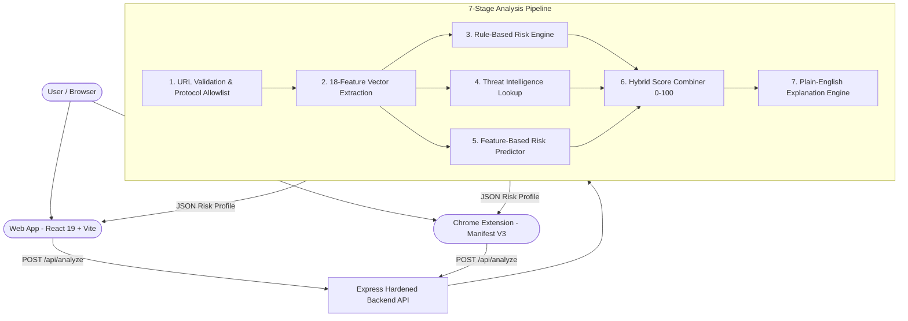

# WebGuard AI - Explainable Phishing and Fake Website Detection System

> "Don't just detect the threat. Understand it."
> An AI-powered, explainable URL security platform that analyzes suspicious links, extracts multi-signal threat vectors, and explains precisely why a link is dangerous in clear, actionable human language.

---

## Documentation and Guides

- [PRESENTATION_NOTES.md](PRESENTATION_NOTES.md): Complete 17-slide pitch deck guide with speaker notes (5 to 6 min).
- [JUDGE_QA.md](JUDGE_QA.md): 15 grounded technical answers for hackathon judges and evaluators.
- [ARCHITECTURE.md](ARCHITECTURE.md): In-depth technical specification, data flow, and diagrams.
- [DEMO_SCRIPT.md](DEMO_SCRIPT.md): 2 to 3 minute timed live demonstration script.
- [DEPLOYMENT.md](DEPLOYMENT.md): Production deployment guide for Render, Vercel, and Chrome Web Store.
- [SECURITY.md](SECURITY.md): Threat model, passive data minimization, and defense mechanisms.
- [FINAL_AUDIT_REPORT.md](FINAL_AUDIT_REPORT.md): Step-by-step feature matrix, test metrics, and verification report.

---

## The Problem

1. Sophisticated Visual Deception: Modern phishing attacks bypass human visual inspection using subtle techniques like unencrypted IP hosts, homograph punycode domain spoofing, and multi-level subdomain obfuscation.
2. Opaque Black-Box Warnings: Traditional web security tools display generic "Site Suspicious" alerts without explaining what triggered the warning, leading to alert fatigue and ignored safety warnings.
3. Blacklist Delay: Newly registered phishing domains often stay active for hours or days before appearing on centralized threat feeds.

---

## The Solution: Detect + Explain + Protect

WebGuard AI inspects URLs through a 7-stage defense-in-depth pipeline:

- Detect: Evaluates an 18-feature lexical vector (IP host detection, punycode, entropy scoring, path depth, suspicious TLDs, keyword spoofing) combined with optional threat intelligence and machine learning risk modeling.
- Explain: Synthesizes transparent, plain-English reasoning explaining the specific risk factors that generated the threat score.
- Protect: Provides clear human safety recommendations, high-risk alert banners, one-click safe retreat actions, and a real-time Chrome Extension (Manifest V3) for instant tab monitoring.

---

## Technical Differentiators

- Explainable Risk Index (0 to 100): Explains why a URL received its score instead of outputting an opaque number.
- 18-Feature Vector Pipeline: Pure Node.js feature extraction executes in under 10ms per request.
- Multi-Signal Hybrid Engine: Combines local lexical analysis (60%), threat intelligence (25%), and ML feature modeling (15%) with dynamic offline fallback (100% local analysis when offline).
- Transparent Fallback: Explicitly states "Local Analysis Mode" when threat feed API keys are omitted, ensuring honest risk communication.
- Manifest V3 Chrome Shield: Real-time browser extension monitoring tab navigation requests with zero background bloat.
- Privacy-First Architecture: Strictly passive URL text inspection. Zero page fetching, zero user tracking, zero server databases.

---

## System Architecture



---

## Tech Stack

- Web Frontend: React 19, Vite 8.2, Lucide Icons, Vanilla CSS
- Backend API: Node.js (ESM), Express 4, CORS, dotenv, In-Memory Sliding-Window Rate Limiter
- Browser Extension: Manifest V3, Service Worker, Chrome Storage API, Responsive Popup UI
- Testing and Quality: Native Node Test Suites (54 Unit Tests + 14 Security Tests)
- Deployment: Vercel / Netlify (Frontend), Render / Railway / Docker (Backend API)

---

## Repository Structure

```
fake-wedsite/
├── backend/
│   ├── middleware/        # Rate limiting, CORS, safe logging
│   ├── routes/            # Express endpoint definitions (/api/analyze, /api/health)
│   ├── services/          # Feature extraction, risk engine, threat intelligence, ML model
│   ├── utils/             # URL normalizer & validator
│   ├── backendTests.js    # 54 automated unit tests
│   ├── testSecuritySuite.js # 14 security & edge-case tests
│   ├── server.js          # Main Express server (Port 5001)
│   └── package.json
│
├── frontend/
│   ├── src/
│   │   ├── components/    # Modular React UI components (Scanner, Result, Academy, etc.)
│   │   ├── services/      # Client API communication & offline fallback
│   │   ├── utils/         # LocalStorage history & demo benchmarks
│   │   ├── App.jsx        # Main React application
│   │   ├── App.css        # Dashboard & responsive design styles
│   │   └── index.css      # Core design tokens & base theme
│   ├── package.json
│   └── vite.config.js
│
├── extension/             # Chrome Extension (Manifest V3)
│   ├── manifest.json      # Extension manifest & permissions
│   ├── background.js      # Service worker active tab monitor
│   ├── popup.html         # Responsive extension interface
│   ├── popup.js           # Extension controller & API fetch
│   └── popup.css          # Extension styling
│
├── ARCHITECTURE.md        # Technical architecture specification
├── DEPLOYMENT.md          # Production deployment guide
├── SECURITY.md            # Threat model & data protection
├── JUDGE_QA.md            # Evaluator Q&A reference
├── PRESENTATION_NOTES.md  # Pitch presentation script
└── README.md              # Project overview
```

---

## Quickstart and Local Setup

### Prerequisites
- Node.js: v18.0.0 or higher
- npm: v9.0.0 or higher

### 1. Clone the Repository
```bash
git clone https://github.com/your-username/fake-wedsite.git
cd fake-wedsite
```

### 2. Start the Backend API Server
```bash
cd backend
npm install
npm run dev
```
The backend API starts on http://localhost:5001.

### 3. Start the Frontend Web Application
Open a new terminal tab:
```bash
cd frontend
npm install
npm run dev
```
The web app opens on http://localhost:5173.

### 4. Load the Chrome Extension
1. Open Google Chrome and navigate to chrome://extensions.
2. Enable Developer mode in the top-right corner.
3. Click Load unpacked in the top-left menu.
4. Select the extension folder from your project directory (D:\Fake Website Detector\code\extension).
5. Click the WebGuard AI shield icon in your Chrome toolbar to inspect active tabs.

---

## API Reference

### POST /api/analyze
Analyzes a target URL and returns a full explainable risk profile.

#### Request Body
```json
{
  "url": "http://login.paypal.verify-accounts.security-update.com/login.php"
}
```

#### Response (200 OK)
```json
{
  "success": true,
  "url": "http://login.paypal.verify-accounts.security-update.com/login.php",
  "score": 85,
  "riskLevel": "HIGH",
  "explanation": "CRITICAL RISK: This URL exhibits severe brand impersonation and multiple high-risk indicators.",
  "whyThisScore": "Flagged due to unencrypted HTTP protocol, multiple subdomain levels (3), and brand spoofing keyword ('paypal').",
  "indicators": [
    {
      "id": "brand_spoofing",
      "name": "Brand Impersonation Detected",
      "severity": "high",
      "description": "Domain contains trusted brand keyword 'paypal' on an unauthorized apex domain."
    },
    {
      "id": "unencrypted_http",
      "name": "Missing HTTPS Encryption",
      "severity": "medium",
      "description": "Connection uses plain HTTP. Passwords transmitted over this link can be intercepted."
    }
  ],
  "recommendation": "Block domain access immediately. Do NOT enter credentials.",
  "analyzedAt": "2026-09-09T10:00:00.000Z"
}
```

---

## Testing and Verification

Run the test suites from the project root:

```bash
# Run Backend Unit Tests (54 tests)
cd backend && node backendTests.js

# Run Hardened Security Audit Suite (14 tests)
node testSecuritySuite.js

# Validate Frontend Production Bundle
cd ../frontend && npm run build
```

---

## Ethics and Disclaimer

- Passive Inspection: WebGuard AI performs passive structural and lexical URL analysis. It does not execute target page JavaScript or render dynamic web content.
- No Absolute Guarantees: A low threat score indicates an absence of detected heuristic anomalies, but does not guarantee a URL is 100% benign. Users should remain vigilant.

---

## License

Distributed under the MIT License. See LICENSE for details.
